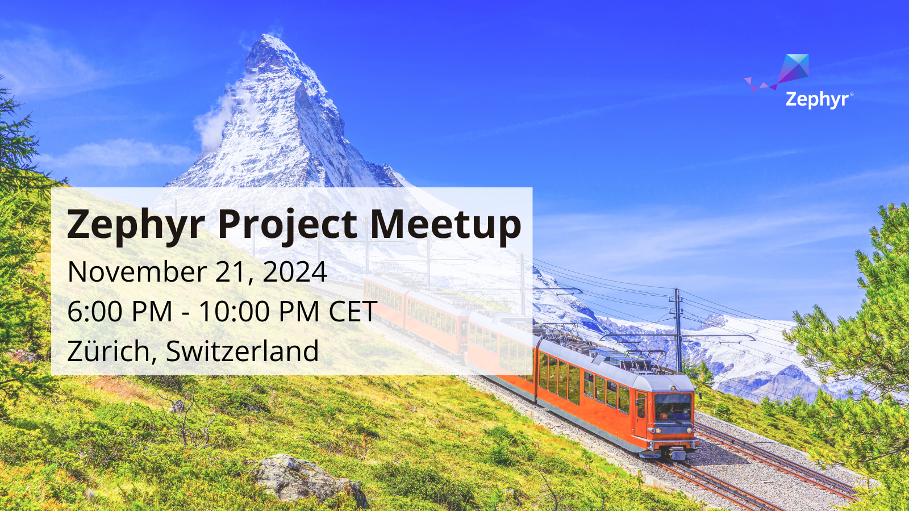

.. Copyright (c) 2024 O.S. Systems Software LTDA.
.. Copyright (c) 2024 Freedom Veiculos Eletricos
.. SPDX-License-Identifier: Apache-2.0
.. _zephyrbt_tutorial:

Zephyr Behaviour Tree - Tutorial
################################

Overview
********

The Let's Drink tutorial was implemented to promote the ZephyrBT at
first Zephyr Zurich meetup on 21 Nov 2024. The application is simpler
and the documentation was written to guide in the basics of Behaviour
Tree using the Groot2 IDE and demonstrate the flexibility of the
technology.

Pre-requirements
================

Make sure you executed the steps from `zephyrbt git hub page`_.

.. _zephyrbt git hub page:
  https://github.com/OSSystems/ZephyrBT

Building and Running
====================

This application can be built and executed on ``native_posix_64`` as follows:

.. code-block:: console

   west build -p -b native_posix_64 samples/subsys/zephyrbt/tutorial -t run

Check the application running on the console.

Lessons
*******

* `lesson 1 - Implement the First Action`_
* `lesson 2 - The Action initialization function`_
* `lesson 3 - Share data between nodes`_
* `lesson 4 - The Behaviour Tree user data holder`_
* `lesson 5 - Using ZBUS`_

.. _lesson 1 - Implement the First Action:
  lessons/lesson-1/lesson-1.rst

.. _lesson 2 - The Action initialization function:
  lessons/lesson-2/lesson-2.rst

.. _lesson 3 - Share data between nodes:
  lessons/lesson-3/lesson-3.rst

.. _lesson 4 - The Behaviour Tree user data holder:
  lessons/lesson-4/lesson-4.rst

.. _lesson 5 - Using ZBUS:
  lessons/lesson-5/lesson-5.rst
