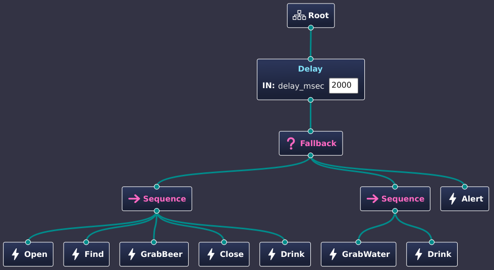

.. Copyright (c) 2024 O.S. Systems Software LTDA.
.. Copyright (c) 2024 Freedom Veiculos Eletricos
.. SPDX-License-Identifier: Apache-2.0
.. _zephyrbt_tutorial_lesson_1:

Zephyr Behaviour Tree - Tutorial - Lesson 1
###########################################

Implement the First Action
**************************

The first example how to implement the Grab Beer Action. The change is add a
counter to make the action fail after some iterations. This simpler example can
be easier translated to check some hardware condition like ADC's, actuators etc.

1- Add a new file at <project>/src/grab_beer.c

2- Add the following content

.. code-block:: c

   #include <stdint.h>
   #include <zephyr/zephyrbt/zephyrbt.h>
   #include <zephyr/sys/util.h>

   #include <zephyr/logging/log.h>
   LOG_MODULE_REGISTER(grab_beer, CONFIG_ZEPHYR_BEHAVIOUR_TREE_LOG_LEVEL);

   enum zephyrbt_child_status
   zephyrbt_action_grab_beer(struct zephyrbt_context *ctx,
            struct zephyrbt_node *self)
   {
      static int count = 0;

      ++count;

      LOG_DBG("\nGrab Beer try: %d\n", count);

      if (count < 3) {
         return ZEPHYRBT_CHILD_SUCCESS_STATUS;
      }

      return ZEPHYRBT_CHILD_FAILURE_STATUS;
   }

3- Update the CMakeLists.c

.. code-block:: cmake

   target_sources(app PRIVATE
      src/main.c
      src/grab_beer.c
   )

4- Run the program again

.. code-block:: console

   $> west build - run

5- Compare the execution

At this time the initial output will be the same but after 3 iterations the
system will grab the water as a fallback action.

You can explore more ideas and try to implement other actions to play with the
application.
