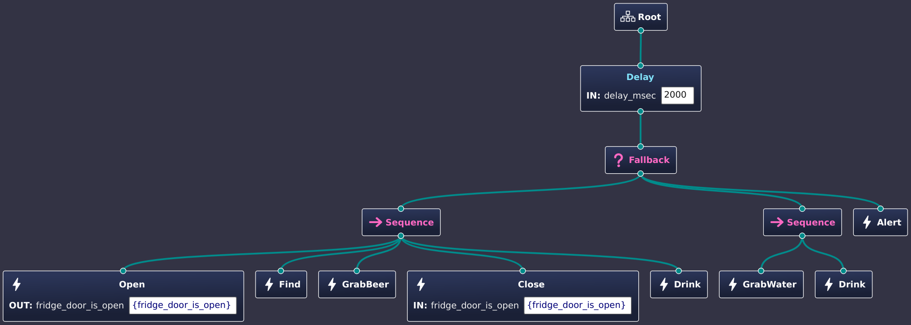

.. Copyright (c) 2024 O.S. Systems Software LTDA.
.. Copyright (c) 2024 Freedom Veiculos Eletricos
.. SPDX-License-Identifier: Apache-2.0
.. _zephyrbt_tutorial_lesson_1:

Zephyr Behaviour Tree - Tutorial - Lesson 3
###########################################

Share data between nodes
************************

At moment it is possible to create very interresting behaviours. However, you may
already be missing a way to communicate and exchange information between the
nodes.

1- Change tutorial model. Add the ``fridge_door_is_open`` port.

In the open/close actions add a port named ``fridge_door_is_open``. Keep open
action as output and close action as input. In the value field add
``{fridge_door_is_open}``.

The port create an entry point that can be used as storage area or can access an
external entry point. The internal are is defined per node instance when the
value is empty or have some default C initialization value. It can be an
integer, a string a enumeration constant etc. It is important that the compiler
can find and process the default value to avoid compiler errors. The shared
entry point is defined by using the syntax ``{`` place name ``}``. The shared
place is thread safe since only one node each time can access the node.

2- Now it is necessary to create ``fridge.c`` file inside src folder. Remember
to add on CMakeLists.txt. Inside this file you can add the following code for
the Open and Close actions.

.. code-block:: c

        #include <stdint.h>
        #include <zephyr/zephyrbt/zephyrbt.h>
        #include <zephyr/sys/util.h>

        #include <zephyr/logging/log.h>
        LOG_MODULE_REGISTER(fridge, CONFIG_ZEPHYR_BEHAVIOUR_TREE_LOG_LEVEL);

        #include "tutorial.h"

        struct zephyrbt_action_fridge_context {
                struct zephyrbt_blackboard_item *is_open;
        };

        enum zephyrbt_child_status
        zephyrbt_action_open_init(struct zephyrbt_context *ctx,
                                struct zephyrbt_node *self)
        {
                struct zephyrbt_action_fridge_context *fridge_ctx;

                fridge_ctx = k_malloc(sizeof(struct zephyrbt_action_fridge_context));
                self->ctx = fridge_ctx;

                if (fridge_ctx == NULL) {
                        LOG_ERR("Context can not be allocate. Need more memory!!");
                        return ZEPHYRBT_CHILD_FAILURE_STATUS;
                }

                memset(fridge_ctx, 0, sizeof(struct zephyrbt_action_fridge_context));

                fridge_ctx->is_open =
                        zephyrbt_search_blackboard(ctx, self->index,
                                ZEPHYRBT_OPEN_ATTRIBUTE_FRIDGE_DOOR_IS_OPEN);

                if (fridge_ctx->is_open == NULL) {
                        LOG_ERR("Not possible to get fridge 'is_open' slot");
                        return ZEPHYRBT_CHILD_FAILURE_STATUS;
                }

                return ZEPHYRBT_CHILD_SUCCESS_STATUS;
        }

        enum zephyrbt_child_status
        zephyrbt_action_close_init(struct zephyrbt_context *ctx,
                                struct zephyrbt_node *self)
        {
                struct zephyrbt_action_fridge_context *fridge_ctx;

                fridge_ctx = k_malloc(sizeof(struct zephyrbt_action_fridge_context));
                self->ctx = fridge_ctx;

                if (fridge_ctx == NULL) {
                        LOG_ERR("Context can not be allocate. Need more memory!!");
                        return ZEPHYRBT_CHILD_FAILURE_STATUS;
                }

                memset(fridge_ctx, 0, sizeof(struct zephyrbt_action_fridge_context));

                fridge_ctx->is_open =
                        zephyrbt_search_blackboard(ctx, self->index,
                                ZEPHYRBT_CLOSE_ATTRIBUTE_FRIDGE_DOOR_IS_OPEN);

                if (fridge_ctx->is_open == NULL) {
                        LOG_ERR("Not possible to get fridge 'is_open' slot");
                        return ZEPHYRBT_CHILD_FAILURE_STATUS;
                }

                return ZEPHYRBT_CHILD_SUCCESS_STATUS;
        }

        enum zephyrbt_child_status
        zephyrbt_action_open(struct zephyrbt_context *ctx,
                        struct zephyrbt_node *self)
        {
                struct zephyrbt_action_fridge_context *fridge_ctx;
                fridge_ctx = (struct zephyrbt_action_fridge_context *)self->ctx;

                if (fridge_ctx->is_open->item == (zephyrbt_node_context_t) true) {
                        LOG_DBG("Fridge is already open, let's skip...");
                        return ZEPHYRBT_CHILD_SKIP_STATUS;
                }

                LOG_DBG("Open the fridge door");

                fridge_ctx->is_open->item = (zephyrbt_node_context_t) true;

                return ZEPHYRBT_CHILD_SUCCESS_STATUS;
        }

        enum zephyrbt_child_status
        zephyrbt_action_close(struct zephyrbt_context *ctx,
                        struct zephyrbt_node *self)
        {
                struct zephyrbt_action_fridge_context *fridge_ctx;
                fridge_ctx = (struct zephyrbt_action_fridge_context *)self->ctx;

                if (fridge_ctx->is_open->item == (zephyrbt_node_context_t) false) {
                        LOG_DBG("Fridge is already closed, let's skip...");
                        return ZEPHYRBT_CHILD_SKIP_STATUS;
                }

                LOG_DBG("Close the fridge door");

                fridge_ctx->is_open->item = (zephyrbt_node_context_t) false;

                return ZEPHYRBT_CHILD_SUCCESS_STATUS;
        }

This unit shares the same context struct and the action nodes will share some
data. If you run the program now you will see messages that nodes are
Open/Closing the Fridge.
