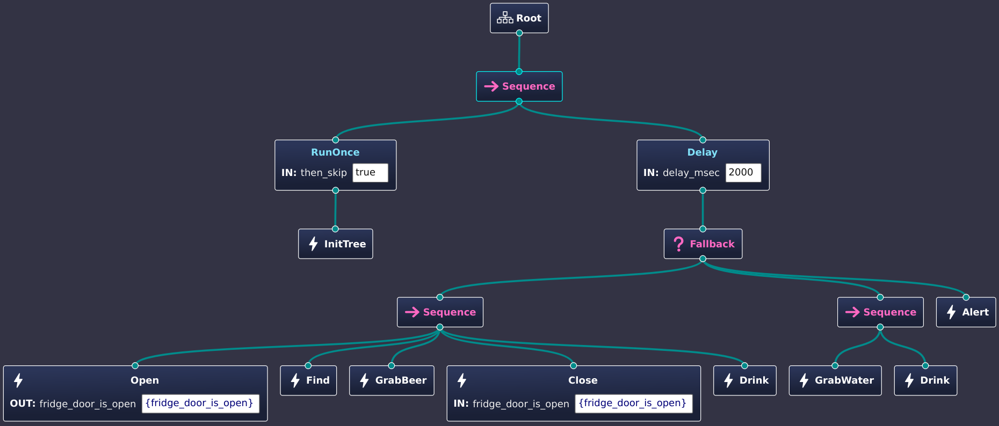

.. Copyright (c) 2024 O.S. Systems Software LTDA.
.. Copyright (c) 2024 Freedom Veiculos Eletricos
.. SPDX-License-Identifier: Apache-2.0
.. _zephyrbt_tutorial_lesson_1:

Zephyr Behaviour Tree - Tutorial - Lesson 4
###########################################

The Behaviour Tree user data holder
**********************************

1- The Behaviour Tree user data holder can be used as a global context for the
whole tree. It can be direct injected when developer wants fine grained control
over the thread or it can be easily managed as the first node init function.
This means that when developer uses code generation it is possible yet to know
and inject this information at code generation phase. After this, any other node
that require access to user global context can do it.

.. code-block:: c

        enum zephyrbt_child_status
        zephyrbt_action_<my_first_action>_init(struct zephyrbt_context *ctx,
                                               struct zephyrbt_node *self)
        {
                struct <my global ctx type> *data;

                data = k_malloc(sizeof(struct <my global ctx type>));
                ctx->user_data = data;

                if (data == NULL) {
                        return ZEPHYRBT_CHILD_FAILURE_STATUS;
                }

                memset(data, 0, sizeof(struct <my global ctx type>));

                return ZEPHYRBT_CHILD_SUCCESS_STATUS;
        }

The global context can be very important to allow one behaviour tree talk with
external components. This components can be other behaviour tree, communication
channels or even thread. In the case of threads the developer should take care
of all shared objects once the premise of the synchronous flow does not exist
anymore.

The developer should pay attention about how much time an action can take to
execute. In this case, a state could be introduced to handle this situations
with the use of ZEPHYRBT_CHILD_RUNNING_STATUS. This means that a node can block
forever if measures to avoid that are not taken.

2- The magical ``zephyrbt_user.h`` file.

When the developer define a file denominated ``zephyrbt_user.h`` it will be
automatically added into ``<my tree>.h`` header file. This is necessary to allow
user defined types be used on the Groot2 IDE, for instance. The example add this
file to define the ``tutorial_context`` structure.
